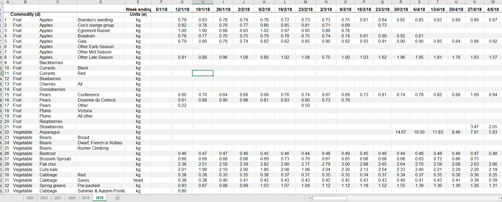

# Fruits and Vegetables UK (2018-2023 ytd)

EDA Definition - Method used by scientist to analyze datasets and summarize their main charascteristics.

Hi! I would like to present you my analysis for Fruits and Vegetables in UK from 2018 till 2023,
I am interested in understanding the following:

Method for this analysis is EDA. (Method used by scientist to analyze datasets and summarize their main charascteristics)

# Ask
* How have the prices of fruits and vegetables changed over years?
* Is there a correlation between the prices of fruits and vegetables?
* Which fruit or vegetable had the largest price increase?
* Which year had the highest percentage increase in prices? 
---
# Prepare
Source of Dataset:
* Data collected from - https://www.gov.uk/government/statistical-data-sets/wholesale-fruit-and-vegetable-prices-weekly-average 
 "Machine-readable: Weekly price time series 2015 to 2023"

> ### Additional source informations:

>  ###### From 1 January 2016 to 1 April 2016 these were the average of the most usual prices charged by wholesales for homegrown fruit, vegetable and flower prices at Birmingham, Liverpool, New Spitalfields and Bristol. Flower prices were also collected at New Covent Garden.
> 
>  ###### From 1 April 2016 to 28 May 2018 these were the average of the most usual prices charged by wholesales for homegrown fruit, vegetable and flower prices at Birmingham, Liverpool, New Spitalfields and Bristol.
> 
>  ###### From 4 June 2018 to 14 January these were the average of the most usual prices charged by wholesales for homegrown fruit, vegetable and flower prices at Birmingham, Manchester, New Spitalfields and Bristol.
> 
>  ###### With effect from 14 January 2019 this has changed to the average of the most usual prices charged by wholesales for homegrown fruit, vegetable and flower prices at Birmingham, Manchester, a London market (either New Spitalfields or Western International Market) and Bristol.
---
### Tools:
* Process&Analysis - Excel, SQLBigQuery
* Vizualizations - Tableau
---

### Data limitations:
This analysis is based on data from 2018 to 2023 year to date.
The incomplete data for 2023 could mean that the results for that year are slightly less accurate than the results for the other years.
However, the overall trend of the prices of fruits and vegetables is still likely to be accurate.

Additionally, the prices of fruits and vegetables can vary depending on a number of factors, such as the weather, the time of year, and the regions.
This means that the results of this analysis may not be generalizable to all fruits and vegetables or to all locations.

---
# Process & Analysis 

### Excel - (Combining and processing data into a format suitable for its handling)

* As seen from picture below Data is in incorrect format and has some additional text information.

* Deletion of unnecessary text from the table and row "Week No" from each sheet.
* Removal of all dates after 18.08 as these rows are empty.
* Sheets 2016-2015 2017-2016 Different data - Also removed.
* Sheet 2017 only contains data from 3/11/2017 to 29/12/2017 - Not much context - Removed
  

* Using PowerQuery to transpose the year and name the price and year columns (repeat for each sheet)
  

* Load data 
* Copy and paste data from all sheets into one

### SQLBigquery
**[here](https://github.com/kac123451/SQL-Fruits_VegesUK/blob/main/Fruits_VegesUK)**

---
# Share&Act 

### Tableau Vizualizations
**[here](https://public.tableau.com/views/FruitsandVegetablespricesUK2018-2023ytd/Story1?:language=en-US&publish=yes&:display_count=n&:origin=viz_share_link)**

---
### Conclusions:

* The prices of fruits and vegetables have increased every year since 2018, except for 2022 for fruits.
*The prices of fruits have increased by 49.3% since 2018, reaching an all-time high in 2023.
* The prices of vegetables have increased by 36% since 2018, also reaching an all-time high in 2023.
* On average, fruits are more expensive than vegetables, with a price of £1.27 per kilogram.
* 2020 was the year with the largest increase in the average price of fruits, while the price of vegetables increased the least in that year.
* The only year that saw a decrease in prices was 2022, for fruits.

---
### Implications of Findings:
The findings of this study have several implications. 
 
* the rising cost of fruits and vegetables could make it more difficult for people to afford a healthy diet. This is a particular concern for low-income households,
* could have a negative impact on the environment. This is because fruits and vegetables are often grown using intensive agricultural practices that can damage the soil and water. 
* and could lead to changes in the way people eat. For example, people may be more likely to choose processed foods instead of fresh fruits and vegetables.

---
### Recommendations

The findings of this study suggest that there is a need for policies to address the rising cost of fruits and vegetables. These policies could include:

Subsidizing the production and sale of fruits and vegetables.
Making fruits and vegetables more accessible to low-income households.
Educating people about the importance of eating a healthy diet.

